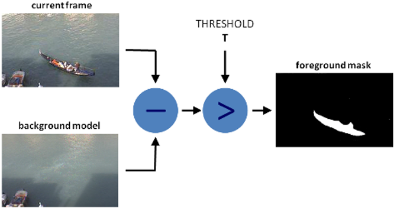
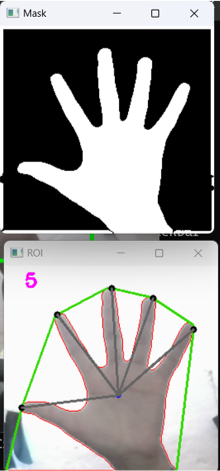
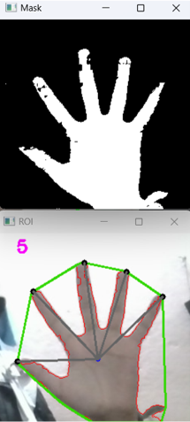
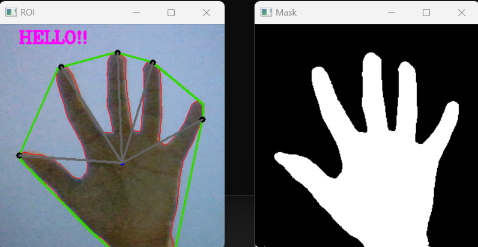
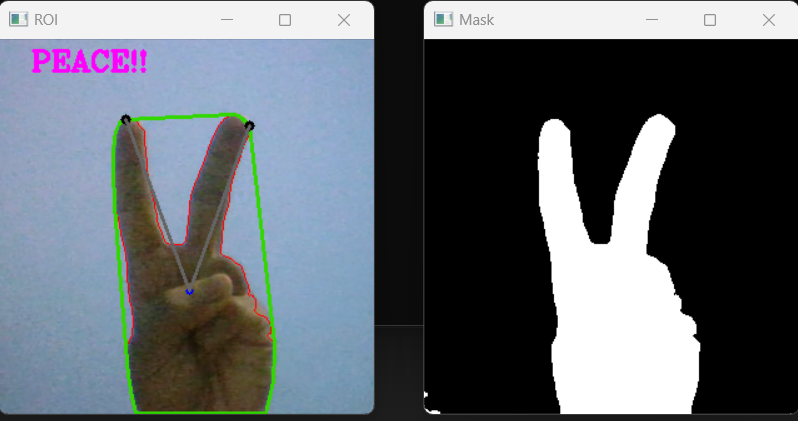

# Communicake: Communication made a piece of cake
Communicake is a simple yet effective gesture recognition program built on the strong capabilities of C++ and advanced libraries such as OpenCV. This project intends to bridge the gap between humans, technology, and other humans by allowing
for basic and intuitive interactions using gesture detection and identification.

# Problem Definition 
The primary problem to be tackled by the “Communicake” project is the accurate detection and recognition of gestures of hand in various environments. Hence, first we isolate the hand from the background. Once hand is isolated, We detect fingers using particular algorithms and define particular gesture for specific hand poses.

# Methodology 
The method or working principle behind our project revolves around two major methods, in which hand is isolated from background by converting frame into binary frame (black/white or 0/1).
1. Background Subtraction Method : 
In this method, a primary frame at particular instance is considered as a background frame, a secondary frame is compared with the background frame and the common element are subtracted; painted black and the changed element between two frames are considered; painted white.This is done by **absdiff()** function provided by OpenCV lib. But this method alone is not perfect as it doesnot really detect hand from background but detect change between frames.

2. HSV (Hue, Saturation, Value) color detection Method:
In this method, hand is isolated from the background by setting HSV color space at a particular range such that skin colored object are considered whereas others are neglected. Still this method alone is not perfect as any object resembling the hand or skin color (maybe face, or skin-painted wall) are detected along with the hand.

Hence we made use of both methods such that at various environment atleast one method work. Once the hand is isolated, we draw a outline or contour using OpenCV's **findContour()** and **drawContour()** methods. Once a contour is drawn for hand, a hull (a tigher, smooth boundary around hand, ignoring inward dents or details, only touching the extreme or outermost points giving a polygonal boundary) is drawn using **convexhull()** function. Now points that are common to contour and hull; extreme point are stored in a variable of **std::vector<>** data type. Now applying different conditions, the point that represent fingertips are only considered. And by counting those fingertips, we define a particular gesture relating to particular number of fingers.

# Application
1. This program allows a person with a disability to use hand gestures to some extent to communicate with a regular person even if he is not familiar with hand or sign language.
2. This program can also be used to assign a specific function (such as opening a particular application) to a specific number of fingers. As an illustration, I personally enjoy coding and debugging while listening to music, so this program can be used to assign finger counts 1 and 2 for opening VS code and Spotify. 

# Conclusion
This is a small, enjoyable project that I worked on with my friends [@LegendaryAsher](https://github.com/LegendaryAsher), [@Beeseat](https://github.com/Beeseat), and [@Knox1837](https://github.com/Knox1837).